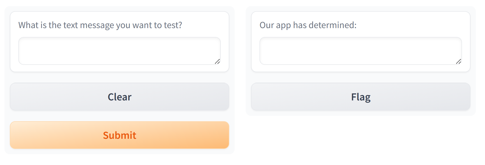
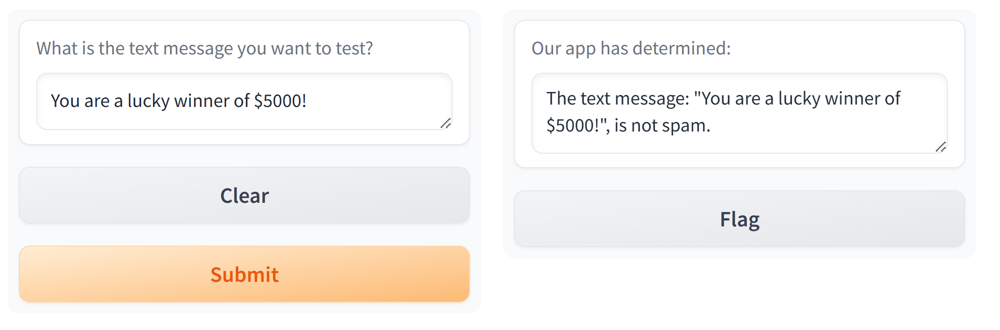
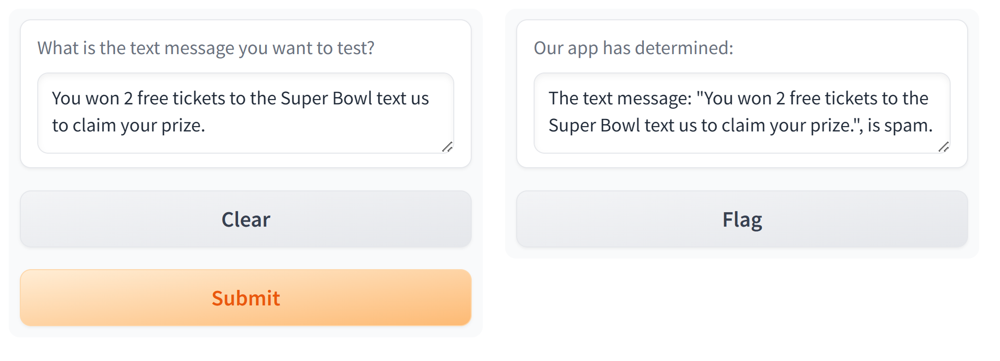

# sms_spam_detector
Assignment for AI/ML Bootcamp Module 22 Challenge

---------------------------------------------------------------------

## Description

Our assignment was to refactor code from an SMS text classification solution into a function that constructs a linear Support Vector Classification (SVC) model. Once the model is created and trained, we created a Gradio application to host the application, enabling users to test text messages. The application provides feedback to users, indicating whether the text is classified as spam or not, based on the model's performance.

This challenge consists of the following subsections:
- Part 1: Create the SMS Classification Function
- Part 2: Create the SMS Prediction Function
- Part 3: Create the Gradio Interface Application
- Part 4: Test the Gradio Interface Application

## Getting Started

### Dependencies

- Python 3.10
- Jupyter Notebook

### Installing

- Clone this repo to your environment

### Executing program

- Open '**gradio_sms_text_classification.ipynb**' in Jupyter Notebook
- Step through the notebook to see my data preparation and analysis by clicking the "Run" button.
- The results are displayed after each step.
---

**Part 1: Create the SMS Classification Function**  
1. Using the starter code in the sms_text_classification_solution.ipynb file, create the sms_classification function in the gradio_sms_text_classification.ipynb by doing the following:  

    - Set the features variable to the text message column of the DataFrame.
    - Set the target variable to the "label" column of the DataFrame.
    - Split data into training and testing and set the test_size to 33%.
    - Build a pipeline to transform the test set to compare to the training set.
    - Fit the model to the transformed training data and return model.

2. Load the SMSSpamCollection.csv into a DataFrame and call the sms_classification function with the DataFrame, and set the result to the "text_clf" variable.
---

**Part 2: Create the SMS Prediction Function**  

Use the sms_prediction function to predict the classification of a new text by doing the following:

1. Create a variable that will hold the prediction of a new text.

2. Use a conditional statement that determines if the text message is "ham" or “spam”.

    - If the message is “ham”, the function should return the following message: **f'The text message: "{text}", is not spam.'**

    - If the message is spam, the function should return the following message: **f'The text message: "{text}", is spam.'**
---

**Part 3: Create the Gradio Interface Application**  

1. Create a Gradio Interface application that takes a textbox for the inputs and has a textbox for the output. The textboxes should have labels that describe what each textbox contains.

2. Launch the application and provide the URL to share the application. The application looks like the following:

---

**Part 4: Test the Gradio Interface Application**  

Use the following text messages to test the application:

1. "You are a lucky winner of $5000!" -- **Determination:  
ham (not spam)**

2. "You won 2 free tickets to the Super Bowl." -- **Determination:  ham (not spam)**

3. "You won 2 free tickets to the Super Bowl. Text us to claim your prize." -- **Determination: spam**

4. "Thanks for registering. Text 4343 to receive free updates on medicare."  -- **Determination: spam**

---

## Help

- Please execute all steps in the notebook.  The results of above steps are used in subsequent steps. 

## Authors

- Author:  Tom Clemons

## Version History

- 0.1
    - Initial Release

## Acknowledgments

- None
